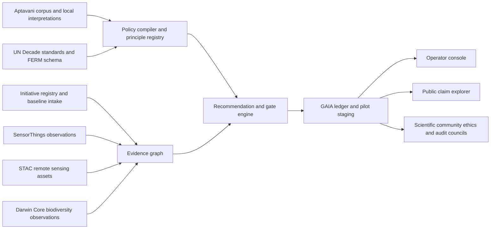

# GAIA-ECO Conceptual Framework

Date: 2026-03-27
Status: research and conceptualization artifact
Scope: Aptavani-informed ecological restoration platform architecture for `dharma_swarm`

## Executive Summary

GAIA-ECO should not start as a generic "AI for sustainability" product. The highest-leverage interpretation of the mission is narrower and more defensible:

1. keep the existing auditable GAIA runtime as the trust kernel
2. add an Aptavani-to-policy layer that translates dharmic principles into explicit platform rules
3. add a standards-aligned restoration registry and evidence plane so real projects, observations, and disputes can be handled without mythologizing the platform

The current repository already ships a meaningful core:

- an append-only GAIA ledger for compute, funding, labor, offset, and verification records
- 3-of-5 oracle verification for ecological claims
- conservation-law checks and Goodhart-drift detection
- a small operator-facing dashboard and pilot staging flow

What is missing is the outer system: initiative intake, geospatial and biodiversity data ingestion, challengeable public reporting, and a principled way to translate Aptavani insights into operational governance. The recommended first build slice is therefore:

`Aptavani policy compiler + FERM-aligned initiative registry + evidence-bound recommendation flow`

That slice is small enough to build on top of the present Python runtime, but strong enough to turn GAIA from a demoable accountability kernel into the first real GAIA-ECO coordination surface.

## Method

This report combines:

- internal repo inspection of the current GAIA runtime and training materials
- internal mission artifacts in `~/.dharma/shared/`
- official Dada Bhagwan / Aptavani source material
- official ecosystem restoration standards and monitoring guidance
- official interoperability standards for geospatial, IoT, and biodiversity data

Important epistemic boundary:

- Aptavani is not an ecological restoration manual.
- The platform design below is an inference from Aptavani principles plus restoration standards.
- Where the report makes an inference rather than restating a source, it is labeled as such.

## Evidence Base

### Internal artifacts

- `/Users/dhyana/.dharma/shared/thinkodynamic_director_vision_2026-03-27T08-52-05Z.md`
- `/Users/dhyana/.dharma/shared/director_council_dialogue.md`
- [`dharma_swarm/gaia_platform.py`](../../dharma_swarm/gaia_platform.py)
- [`dharma_swarm/gaia_ledger.py`](../../dharma_swarm/gaia_ledger.py)
- [`dharma_swarm/gaia_verification.py`](../../dharma_swarm/gaia_verification.py)
- [`dharma_swarm/gaia_fitness.py`](../../dharma_swarm/gaia_fitness.py)
- [`gaia_ui.md`](../../gaia_ui.md)
- [`docs/dse/GAIA_FACILITATOR_GUIDE.md`](../dse/GAIA_FACILITATOR_GUIDE.md)
- [`docs/dse/GAIA_TRAINING_WORKBOOK.md`](../dse/GAIA_TRAINING_WORKBOOK.md)
- `/Users/dhyana/Persistent-Semantic-Memory-Vault/01-Transmission-Vectors/aptavani-derived/claude-first-reading-aptavani.md`
- [`docs/reports/JAGAT_KALYAN_RECIPROCITY_COMMONS_2026-03-11.md`](./JAGAT_KALYAN_RECIPROCITY_COMMONS_2026-03-11.md)
- [`docs/reports/PLANETARY_RECIPROCITY_COMMONS_GOVERNANCE_CHARTER_2026-03-11.md`](./PLANETARY_RECIPROCITY_COMMONS_GOVERNANCE_CHARTER_2026-03-11.md)

### External sources

- S1. Dada Bhagwan Foundation, "Path to Enlightenment | Akram Vignan"
  - http://dadabhagwan.org/akram-vignan.html
- S2. Dada Bhagwan Foundation, "Non Violence (Ahimsa) and Spiritual Awareness"
  - https://www.dadabhagwan.org/path-to-happiness/spiritual-science/non-violence-and-spiritual-awareness/
- S3. Dada Bhagwan Foundation, "Why can't I control anything in my life?"
  - https://www.dadabhagwan.org/path-to-happiness/self-help/how-to-stop-worrying/who-is-the-doer/
- S4. Dada Bhagwan Foundation, "How to lead someone to the path of Self Realization?"
  - https://www.dadabhagwan.org/path-to-happiness/spiritual-science/the-essence-of-all-religion/salvation-of-the-world/
- S5. Dada Bhagwan Foundation, "Aptavani 1"
  - https://download.dadabhagwan.org/books/English/PDF/aptavani-01.pdf
- S6. FAO / UNEP / partners, "Principles for ecosystem restoration to guide the United Nations Decade 2021-2030"
  - https://openknowledge.fao.org/server/api/core/bitstreams/b234f058-9f77-4481-b870-a7fa2e7ad5f8/content
- S7. FAO / SER / IUCN CEM, "Standards of practice to guide ecosystem restoration"
  - https://openknowledge.fao.org/server/api/core/bitstreams/90ed5439-59f7-4e7c-8a46-17059065aadb/content
- S8. FAO, "Framework for Ecosystem Restoration Monitoring (FERM) user guide", November 2024 draft
  - https://ferm.fao.org/docs/ferm_user_guide_draft.pdf
- S9. OGC, "SensorThings API Overview"
  - https://ogcapi.ogc.org/sensorthings/overview.html
- S10. STAC, "About STAC"
  - https://stacspec.org/en/about/
- S11. TDWG, "Darwin Core Quick Reference Guide"
  - https://dwc.tdwg.org/terms/

## What Aptavani Contributes

### Principle Translation Table

| Principle | Source basis | Translation into platform behavior |
| --- | --- | --- |
| `ahimsa` | S2 defines non-violence as not hurting any living being, even slightly, through mind, speech, or body. | Projects that degrade biodiversity, use invasive species, displace people without consent, or cause measurable collateral harm should be blocked or downgraded. |
| `open viewpoints` -> `anekanta` (inference) | S5 says liberation requires freedom from prejudices, partialities, and insistence of opinion; the Gnani is described as open to all viewpoints. Current code already uses `anekanta` in `GAIA_PRINCIPLES`. | The platform should preserve disagreement, require multiple evidence channels, and expose challenge paths instead of collapsing uncertainty into a single score. |
| `vyavasthit` / scientific circumstantial evidence | S1 and S3 frame outcomes as arising from scientific circumstantial evidences rather than a heroic doer. | Project recommendations should be justified through observable conditions, drivers, baselines, and evidence links, not charismatic storytelling. |
| `jagat kalyan` / becoming an instrument | S4 emphasizes becoming an instrument for the world's welfare; internal mission artifacts use jagat kalyan as the telos. | Optimize for ecological recovery and human well-being together. Carbon alone is insufficient. Community benefit-sharing, labor transition, and stewardship quality belong in the objective function. |
| `Akram as practical applied spiritual science` | S1 explicitly describes Akram Vignan as practical, applied, and result-oriented. | The Aptavani layer should compile into rules, checklists, and measurable governance criteria. It should not remain a purely symbolic narrative layer. |
| `humility / non-doership` | S1 and S3 reject naive doership; the local Aptavani-derived note emphasizes instrumentality and reduction of obstinacy. | GAIA-ECO should remain a decision-support and accountability platform, not an opaque autonomous controller. Human stewards remain accountable for land and community decisions. |

### Design implications

1. Claims must remain challengeable.
2. Community knowledge must be first-class, not decorative.
3. Ecological integrity and livelihood integrity must be co-measured.
4. The system should preserve visible reversals, disagreements, and uncertainty.
5. Every recommendation should carry an evidence path and uncertainty surface.

## What Already Exists In This Repository

### Shipped GAIA kernel

The repository already contains a credible trust kernel for GAIA:

- `gaia_ledger.py` models five unit types: compute, offset, funding, labor, verification
- `gaia_verification.py` implements 3-of-5 oracle verification over `satellite`, `iot_sensor`, `human_auditor`, `community`, and `statistical_model`
- `gaia_fitness.py` adds conservation integrity, verification coverage, oracle diversity, and Goodhart-drift detection
- `gaia_platform.py` wraps the core into a small operator surface for assessment, recommendation, pilot staging, and terminal rendering
- `gaia_ui.md`, the facilitator guide, and the workbook explicitly position the current runtime as an auditable accountability loop rather than a production web platform

### Current strengths

- append-only auditable record
- explicit distinction between claims and verified impact
- preserved disagreement instead of forced consensus
- anti-greenwashing orientation already embedded in the runtime
- direct path to pilotable operator workflows

### Current gaps

- no structured Aptavani corpus or policy compiler
- no initiative intake schema aligned with restoration standards
- no geospatial data plane for sites, baselines, or monitoring polygons
- no biodiversity observation schema or import path
- no challenge desk or public claim explorer
- no community-governance workflow
- no long-running coordination surface for restoration operators

## External Restoration Standards That GAIA-ECO Should Respect

### Non-negotiable requirements from restoration standards

From S6, S7, and S8, the platform should assume:

1. restoration must contribute to biodiversity, ecosystem integrity, and human well-being together
2. inclusive governance and free, prior, and informed consent matter from the start
3. projects need measurable short-, medium-, and long-term goals
4. local ecological and socioeconomic context must be captured alongside landscape context
5. monitoring starts at project inception and continues beyond initial implementation
6. adaptive management is part of the core process, not a postscript
7. knowledge integration must include scientific, local, Indigenous, and community forms

### Implication for product design

GAIA-ECO cannot just be:

- an LLM that reads spiritual texts and suggests sustainability ideas
- a carbon ledger with inspirational copy
- a project marketplace without monitoring structure

It needs to function as a standards-aware restoration operating system.

## Proposed GAIA-ECO Architecture

### System thesis

GAIA-ECO should be a six-layer system:

1. `knowledge and policy layer`
2. `initiative and observation layer`
3. `evidence and verification layer`
4. `reasoning and recommendation layer`
5. `coordination and reporting layer`
6. `commons governance layer`

### Architecture sketch

### Layer 1: Knowledge and policy

Purpose:

- represent the Aptavani-derived principles in machine-readable form
- distinguish direct source statements from downstream design inferences
- compile principles into checkable gates and reporting obligations

Core artifacts:

- source registry for Aptavani passages and official Dada Bhagwan pages
- principle registry with provenance, interpretation status, and conflict notes
- policy compiler that turns principles into concrete checks

Examples of compiled policy:

- `ahimsa_gate`: reject or require escalation when restoration activity implies net ecological harm, coercion, or unresolved displacement
- `anekanta_gate`: require at least three evidence channels before high-confidence public ecological claims
- `jagat_kalyan_gate`: require explicit local benefit-sharing and stewardship evidence for public flagship status

### Layer 2: Initiative and observation

Purpose:

- intake restoration initiatives in a standards-aligned schema
- store baseline, geography, actors, planned activities, and monitoring design
- ingest field and remote observations over time

Recommended standards and interfaces:

- FERM-compatible initiative structure for planning, implementation, monitoring, and reporting (S8)
- IUCN Global Ecosystem Typology tagging via the FERM approach (S8)
- OGC SensorThings for IoT and field sensor observations (S9)
- STAC for remote sensing and geospatial asset discovery (S10)
- Darwin Core for biodiversity and occurrence records (S11)

### Layer 3: Evidence and verification

Purpose:

- extend the current GAIA ledger into a full evidence plane
- keep claims, evidence, verification, dissent, and reversals visible

Reuse from current repo:

- `gaia_ledger.py`
- `gaia_verification.py`
- `gaia_fitness.py`

Required additions:

- evidence object store with content hashes
- claim-to-evidence graph
- challenge and remediation records
- consent and grievance records
- public integrity classes such as `experimental`, `emerging`, `high_integrity`

### Layer 4: Reasoning and recommendation

Purpose:

- generate candidate actions and project assessments grounded in both Aptavani policy and restoration standards

Constraints:

- recommendations must be source-cited
- reasoning must separate facts from inferred guidance
- the engine must remain advisory
- uncertainty and missing data must remain visible

Output types:

- project fitness and risk assessment
- required remediation steps
- pilot design suggestions
- monitoring and verification plan suggestions
- dispute escalation suggestions

### Layer 5: Coordination and reporting

Purpose:

- turn the system from a ledger into an operating surface

User-facing functions:

- register restoration initiative
- define baseline and area
- attach evidence and monitoring streams
- request Aptavani-aligned project assessment
- publish integrity-scored claim cards
- run adaptive-management reviews
- generate pilot reports for funders, communities, and auditors

### Layer 6: Commons governance

Purpose:

- ensure the platform does not collapse into a legitimacy shield for extractive actors

Required bodies, adapted from adjacent local governance work:

- scientific and MRV council
- community and worker council
- ethics and alignment council
- audit and challenge desk

These governance surfaces are not optional add-ons. They are the product-level realization of `anekanta`, `ahimsa`, and `jagat kalyan`.

## Recommended Functionalities

### Core functionality set

1. `Aptavani policy browser`
   - browse principles, interpretations, and linked platform rules

2. `initiative registry`
   - create restoration initiatives with standards-aligned metadata, area definitions, ecosystem types, actors, and goals

3. `baseline and monitoring workspace`
   - store baseline indicators, monitoring plans, and periodic observations

4. `multi-oracle verification workspace`
   - extend the current 3-of-5 oracle model to project-level evidence review

5. `public claim explorer`
   - display claim class, evidence path, audit status, challenge status, and reversals

6. `adaptive management review`
   - compare actual conditions against goals, highlight drift, and propose next actions

7. `pilot staging and reciprocity routing`
   - connect AI-compute accountability flows to credible restoration pilots and community benefit pathways

### Explicit non-goals for the first version

- not a "spiritual chatbot"
- not a generic carbon offset marketplace
- not an autonomous land management agent
- not a claims platform without evidence provenance

## Technical Requirements

### Platform requirements

| Category | Minimum requirement | Why it matters |
| --- | --- | --- |
| data model | typed schemas for initiatives, sites, actors, claims, evidence, consent, challenges, and monitoring indicators | prevents vague narrative objects |
| persistence | append-only ledger plus relational store and object storage | keeps both auditability and queryability |
| geospatial | PostGIS-backed geometry, STAC asset references, map-ready APIs | restoration work is spatial by default |
| field ingestion | SensorThings-compatible observation ingestion and manual upload paths | allows mixed-tech field programs |
| biodiversity | Darwin Core-compatible occurrence or event imports | avoids custom biodiversity schema drift |
| reasoning | retrieval plus rule evaluation, with evidence citations in every output | keeps the AI layer auditable |
| governance | role-based access for science, community, audit, and operator roles | commons rules require enforceable roles |
| public reporting | claim cards with methodology, integrity class, evidence path, and challenge path | anti-greenwashing depends on this |

### Suggested implementation stack from current repo reality

If built from the current Python base, the default stack should be:

- Python + Pydantic for schemas
- FastAPI for APIs
- PostgreSQL + PostGIS for structured and geospatial state
- object storage for imagery, reports, and evidence bundles
- existing GAIA ledger for append-only integrity
- optional vector or keyword index for Aptavani and standards retrieval

This keeps the first implementation aligned with the current codebase instead of introducing a parallel stack.

## Highest-Leverage Slice To Build Next

### Proposed first implementation boundary

Build:

1. `Aptavani principle registry`
2. `FERM-aligned initiative schema`
3. `policy compiler that maps principles to gates`
4. `recommendation endpoint that emits evidence-bound assessments`
5. `public project card with integrity class and challenge path`

Do not build yet:

- a full production dashboard suite
- complex predictive ecology models
- live sensor integrations beyond a narrow ingestion contract
- marketplace or payment rails

### Why this is the right slice

It composes cleanly with what already exists:

- the current GAIA kernel already knows how to record claims and verifications
- the missing leverage is structure, standards-aligned intake, and policy translation
- this slice is enough to validate whether Aptavani principles can govern a real restoration workflow without overcommitting to a large platform build

## Risks

### Primary risks

1. `spiritual overclaim`
   - treating Aptavani as if it directly answers ecology questions it does not explicitly address

2. `greenwashing by inspiration`
   - using dharmic language to add moral cover without upgrading evidence quality

3. `single-metric collapse`
   - optimizing for carbon while losing biodiversity, rights, or livelihood integrity

4. `community extraction`
   - importing local or Indigenous knowledge without real consent, governance power, or benefit-sharing

5. `model hallucination`
   - allowing the AI layer to produce confident recommendations unsupported by evidence

### Required countermeasures

- keep direct source statements and design inferences separate
- require evidence links for every public claim
- preserve dissent and reversals
- store consent and grievance status as first-class data
- keep humans accountable for consequential decisions

## Potential Impact

If built well, GAIA-ECO could produce five meaningful effects:

1. a challengeable, auditable bridge between AI externalities and ecological repair
2. a standards-aware restoration intake and monitoring surface for smaller operators
3. a dharmic governance layer that constrains claims instead of merely inspiring them
4. better alignment between ecological, livelihood, and community integrity metrics
5. a credible public-benefit narrative for AI reciprocity that is not just carbon marketing

## Conclusion

The strongest interpretation of GAIA-ECO is not "Aptavani for climate inspiration." It is:

`an auditable restoration coordination system whose governance and evidence rules are shaped by Aptavani-informed commitments to non-harm, non-insistence, contextual causality, and universal welfare`

The repository already contains the kernel for this in the existing GAIA runtime. The next step is not a grand platform rewrite. The next step is to harden that kernel with:

- principle compilation
- standards-aligned initiative intake
- evidence-bound reasoning
- public challengeability

That is the smallest slice that can prove the concept without drifting into parallel chatter or speculative platform mythology.
